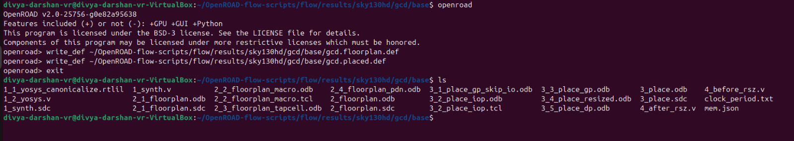
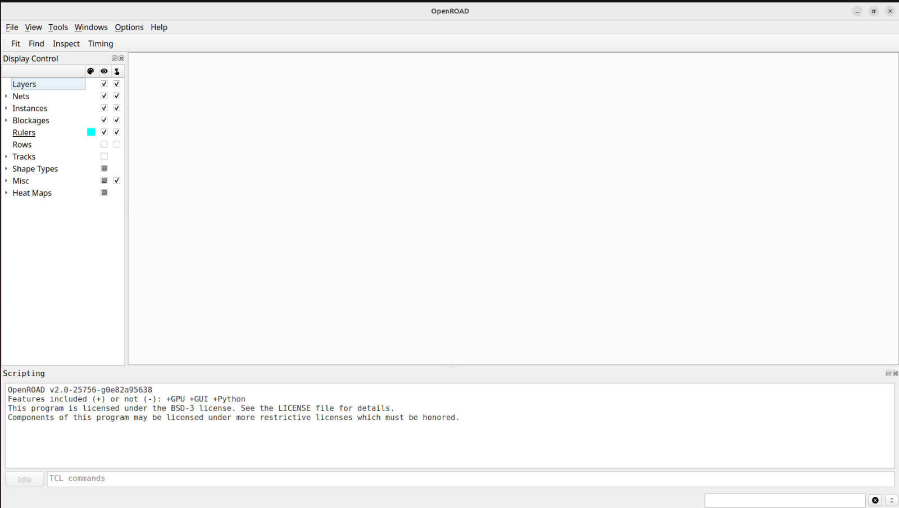

# Week 5 - RISC-V SoC Tapeout Journey (Divya Darshan)

[](https://github.com/DivyaDarshan09)

This repository documents the work done in **Week 5** of my 20-week RISC-V SoC Tapeout project powered by VLSI System Design (VSD) and IIT Gandhinagar.

---
## Objective of Week 5
- To set up the OpenROAD Flow Scripts environment and execute the Floorplan and
- Placement stages of the physical design flow.
- This task transitions you from SPICE-level transistor design (Week 4) to backend implementation, where logic is converted into an actual physical layout.
---
### Tools Required 
```bash
OpenRoad
```
- OpenROAD is an open-source physical design automation (PDA) tool that enables the automatic RTL-to-GDSII flow for digital integrated circuit (IC) design.
- It aims to create a fully autonomous, open-source, and industrial-grade ASIC design toolchain — helping users go from Verilog RTL → GDSII layout without relying on proprietary EDA software.
---
## Installation Steps:
1. Clone and Build OpenROAD

- First, clone the OpenROAD repository — the core physical design engine.
```bash
# Clone the OpenROAD repository
git clone https://github.com/The-OpenROAD-Project/OpenROAD.git
cd OpenROAD
sudo ./etc/DependencyInstaller.sh -all

# Create build directory and compile
mkdir build && cd build
cmake ..
make
sudo make install
```
- After successful build, the OpenROAD binary will be available at:
```bash
OpenROAD/build/src/openroad
```
- Verify the installation:
```bash
./build/src/openroad -version
```
- OpenROAD is now installed and ready for use as a standalone tool or for integration in custom flows.

2. Clone and Set Up OpenROAD-flow-scripts.

- Next, clone the OpenROAD-flow-scripts repository — which provides a complete automated RTL-to-GDSII flow built around OpenROAD.

```bash
# Clone the flow scripts repository
git clone https://github.com/The-OpenROAD-Project/OpenROAD-flow-scripts.git
cd OpenROAD-flow-scripts
```
- Run the installation script:
```bash
./flow/scripts/build_openroad.sh --local
```
- This script automatically:

    - Installs required dependencies.
    - Builds and installs OpenROAD locally under tools/OpenROAD/
    - Sets up additional tools (Yosys, OpenSTA, etc.)
    - Configures the environment for flow execution.

- Verify the build:
```bash
openroad
```
- The terminal will change into openroad shell .

**Screenshot of the terminal**


---
# Floorplan and Placement of GCD Design
## Objective
- To run the OpenROAD flow only up to the Floorplan and Placement stages using the sample GCD (Greatest Common Divisor) design from the Sky130 PDK.
- Routing and later stages are intentionally skipped for this week.
---
## Running the Flow
1. Navigate to Flow Directory
```bash
cd OpenROAD-flow-scripts/flow
```

2. Execute the Flow for GCD
- Run up to the floorplan and placement stages:
```bash
# Run GCD design flow for floorplan and placement only
make DESIGN_CONFIG=./designs/sky130hd/gcd/config.mk FLOW_STEPS="synth_floorplan place"
```
- This command will restrict the flow till floorplan & Placement.

3. Create results folder
- All generated files will be stored under:
```bash
mkdir -p ~/OpenROAD-flow-scripts/flow/results/sky130hd/gcd/base
```
- Run OpenROAD and write DEF files again
```bash
openroad
```
- Inside OpenROAD:
```bash
# Floorplan DEF
write_def ~/OpenROAD-flow-scripts/flow/results/sky130hd/gcd/base/gcd.floorplan.def

# Placement DEF
write_def ~/OpenROAD-flow-scripts/flow/results/sky130hd/gcd/base/gcd.placed.def
```
**Screenshot of Openroad Shell**


**Screenshot : After running the script these files will be generated**


- Use the OpenROAD GUI on the .odb file directly:
```bash
openroad -gui
```
This should open the GUI. Then in the GUI menu:

- File → Open → Floorplan / Placement .odb
- Select 2_floorplan.odb for floorplan or 3_place.odb for placement.
- This bypasses the need for read_odb in the Tcl console.

**Screenshot : GUI**


**Screenshot : Floorplan View**


**Screenshot : Placement View**


---
## Results
### Die area
**Definition** : The total rectangular boundary of the chip, including the core and all surrounding space (IO pads, buffers, routing space, and margins).

- Commands Used
```bash
cd OpenROAD-flow-scripts/flow/results/sky130hd/gcd/base
grep DIEAREA 2_floorplan.def
```
**Terminal Output**


### Floorplan Verification
- Commands Used
```bash
cd OpenROAD-flow-scripts/flow/results/sky130hd/gcd/base
openroad

# Once inside the OpenROAD shell:
read_db 2_floorplan.odb
report_design_area
```


**Design area Definition**: The actual area used by standard cells — the “active” area where logic resides.

- From the terminal output, Total utilized area of the core after floorplan is `2441 µm²`.
- Ratio of standard-cell area to total core area(utilization) is `43%` — ideal (typically between 40–70%).

### Placement Verification
- Commands Used (inside openroad shell)
```bash
read_db 3_5_place_dp.odb
report_design_area
```
**Screenshot**: SS of design area after placement of standard cells.


### Comparison With Floorplan
| Stage      | Design Area | Utilization |
|------------|------------|-------------|
| Floorplan  | 2441 µm²   | 43%         |
| Placement  | 3623 µm²   | 64%         |

#### Observation:

1. **Design area increased:**

- During floorplan, cells were roughly estimated or left unplaced → smaller area.
- After placement, all standard cells are actually positioned, so the occupied area increased.

2. **Utilization increased:**

- From 43% → 64% → more of the core area is now effectively used.
- This is expected as placement packs cells efficiently within the core.

So from the overall observation,
```bash
Floorplan stage: Provides a rough estimate of core area and die size.
Placement stage: Cells are physically positioned → actual area usage becomes visible → utilization rises.
```
---
## Challenges Faced and How I Overcame Them
1. **Installing OpenROAD and Flow Scripts**
   - Setting up OpenROAD and its flow scripts was the major problem i faced due to multiple dependencies and build steps error. I tried for more than 2 days and not able to rectify it. Then a video of installation was there in youtube by NPTEL in a course called `VLSI Design Flow:RTL to GDS`.
   I followed it and build the installation perfectly without any errors.

2. **Interpreting DEF and ODB files**
   - The `.def` and `.odb` files were large and complex, making it hard to know what values to verify.
   - SO i used chatgpt to view the die and design area, and it gave the following commands `grep DIEAREA`, `less`, and OpenROAD CLI commands (`read_db` and `report_design_area`) to focus on relevant sections for verification.

These are the 2 problems I faced and I overcame it smoothly.

---  
## Conclusion

The OpenROAD flow for the GCD design was successfully executed up to the **Floorplan and Placement stages**.

**Floorplan stage** generated the core and die boundaries:

- Design area = 2441 µm²  
- Utilization = 43%  
- Provided a rough estimate of the required core area.

**Placement stage** physically positioned all standard cells:

- Design area = 3623 µm²  
- Utilization = 64%  
- Increased utilization shows efficient packing of cells within the core.

- Logs and DEF/ODB files confirm **successful stage execution with no errors**.
- The design is now ready for the **next stages (Clock Tree Synthesis and Routing)** in upcoming weeks.

---
## What I Learned This Week

- Difference between **Die Area** and **Design/Core Area**, and understanding **utilization**.  
- How the **floorplan stage** sets core region, die boundaries, and early placement constraints.  
- How the **placement stage** physically positions standard cells to optimize area usage.  
- How to **use OpenROAD CLI** commands like `read_db` and `report_design_area` to verify design metrics.  
- Importance of **checking logs and output files** for correctness before proceeding to later stages.  
- Practical experience with **OpenROAD flow for RTL-to-GDSII automation**.

**This week has been a wonderful week**
**I'm truly grateful for this oppurtunity, excited for the upcoming weeks**
**Thanks Team VSD**

---

